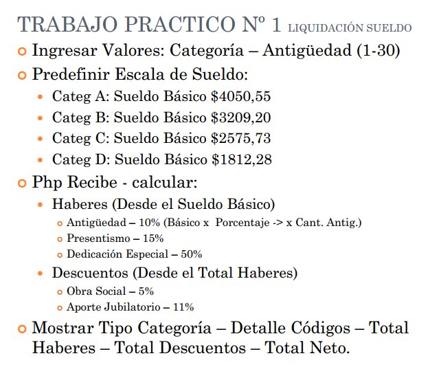

## Trabajo practico

### Calculadora de sueldo

### Catedra de programacion 3

#### Maximiliano Ivan de la Fuente

   

Realizar un programa en php que calcule el sueldo de un empleado
en base a las sigientes entradas:

<a href="https://github.com/maxiivandlf" target="_blank">Link GitHub </a>
